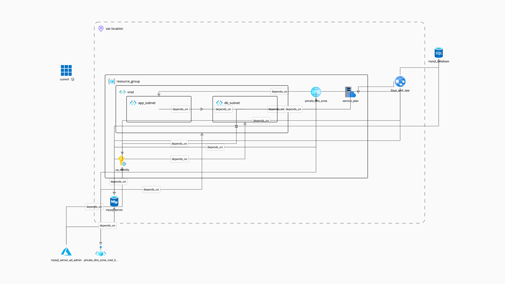

# Azure WordPress on App Service — Terraform

## Project Overview

This project deploys a WordPress site on **Azure App Service (Linux)** backed by **Azure Database for MySQL Flexible Server**, using Terraform as the IaC tool. All resources communicate over a private Virtual Network — the database is never exposed to the public internet.

## Table of Contents

- [Prerequisites](#prerequisites)
- [Architecture](#architecture)
- [Setup Instructions](#setup-instructions)
- [Variables](#variables)
- [CI/CD Pipeline](#cicd-pipeline)
- [Resources](#resources)
- [License](#license)

## Prerequisites

- [Terraform](https://www.terraform.io/downloads.html) >= 1.5.0 installed
- Azure CLI installed and authenticated (`az login`)
- An Azure subscription
- A **remote backend** already created before running `terraform init`:
  - Resource group: `tf-backend-rg`
  - Storage account: `drtfbkend`
  - Blob container: `terraform`
  - Create with: `az storage account create ...` (see [Terraform Azure backend docs](https://developer.hashicorp.com/terraform/language/settings/backends/azurerm))

## Architecture

The following Azure resources are provisioned:

| Resource | Purpose |
|---|---|
| Resource Group | Container for all resources |
| Virtual Network (`10.0.0.0/23`) | Private network backbone |
| App Subnet (`10.0.0.0/25`) | VNet Integration for App Service |
| DB Subnet (`10.0.0.128/25`) | Private access for MySQL Flexible Server |
| Network Security Groups | Restrict inbound/outbound traffic per subnet |
| User-Assigned Managed Identity | Passwordless auth between App Service and MySQL |
| Private DNS Zone | Resolves MySQL FQDN within the VNet |
| App Service Plan (Linux) | Hosts the WordPress web app |
| Linux Web App | WordPress via Microsoft's Docker image |
| MySQL Flexible Server | Managed MySQL database |
| MySQL AD Administrator | Managed identity as the DB admin |



## Setup Instructions

1. **Clone the repository**
   ```sh
   git clone https://github.com/DRSeppings/azure-wordPress.git
   cd azure-wordPress
   ```

2. **Create your variable file** (never commit this file)
   ```sh
   cp terraform.tfvars.example terraform.tfvars
   # Edit terraform.tfvars with your values
   ```

3. **Initialise Terraform** (remote backend must already exist — see Prerequisites)
   ```sh
   terraform init
   ```

4. **Plan the infrastructure**
   ```sh
   terraform plan
   ```

5. **Apply the configuration**
   ```sh
   terraform apply
   ```

## Variables

Copy `terraform.tfvars.example` to `terraform.tfvars` and populate the following required values:

| Variable | Description | Default |
|---|---|---|
| `project_name` | Name suffix for all resources | `moth-wordpress` |
| `webapp_url_name` | Globally unique App Service name (`<name>.azurewebsites.net`) | **required** |
| `location` | Azure region | `northeurope` |
| `environment` | Environment prefix (`dev`, `prod`) | `dev` |
| `wordpress_admin_email` | WordPress admin email | **required** |
| `wordpress_admin_user` | WordPress admin username | **required** |
| `db_server_admin_login` | MySQL admin username | **required** |
| `app_service_sku` | App Service Plan SKU | `B1` |
| `mysql_sku` | MySQL Flexible Server SKU | `B_Standard_B1s` |
| `mysql_zone` | MySQL availability zone | `1` |
| `mysql_version` | MySQL engine version | `8.0.21` |
| `mysql_backup_retention_days` | Automated backup retention in days (7–35) | `7` |
| `mysql_geo_redundant_backup` | Enable geo-redundant backups | `false` |
| `tags` | Map of tags applied to all resources | `{}` |

## CI/CD Pipeline

The `terraform-pipelines.yml` Azure DevOps pipeline runs on pushes to `main` and is split into two stages:

1. **Plan** — runs `terraform init` and `terraform plan`, publishes the plan file as an artifact.
2. **Apply** — downloads the plan artifact and runs `terraform apply`. This stage targets the `production` **environment** in Azure DevOps, which should have a manual approval check configured.

To configure the approval gate:
> Azure DevOps → Pipelines → Environments → `production` → Approvals and checks → Add approval

The pipeline requires an Azure DevOps variable group named `azure-vars` containing:
- `ARM_CLIENT_ID`
- `ARM_CLIENT_SECRET`
- `ARM_SUBSCRIPTION_ID`
- `ARM_TENANT_ID`

## Resources

- [Terraform AzureRM Provider](https://registry.terraform.io/providers/hashicorp/azurerm/latest/docs)
- [Azure App Service WordPress](https://learn.microsoft.com/en-us/azure/app-service/quickstart-wordpress)
- [Azure Database for MySQL Flexible Server](https://learn.microsoft.com/en-us/azure/mysql/flexible-server/overview)
- [Terraform Azure Backend](https://developer.hashicorp.com/terraform/language/settings/backends/azurerm)

## License

This project is licensed under the MIT License. See the [LICENSE](LICENSE) file for details.